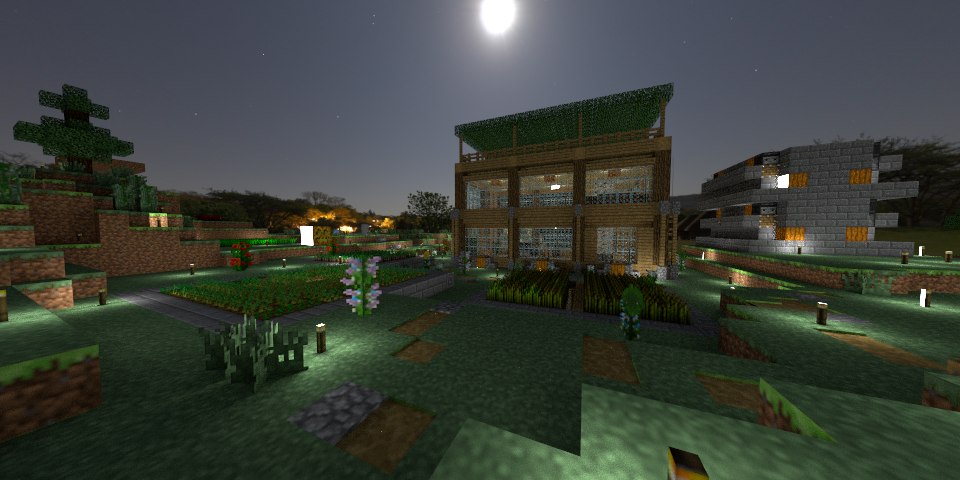

# pbrt-v3-minecraft

[Origin pbrt-v3 README](originREADME.md)

## Change

* Use nearest neighbor instead of bilerp in texture sampling.
* Add `Quad_.h/cpp`.
* PNG file can be read as rgb texture or alpha float texture in **Imagemap**.
* Add tintMap in **Matte**. 

## Result

